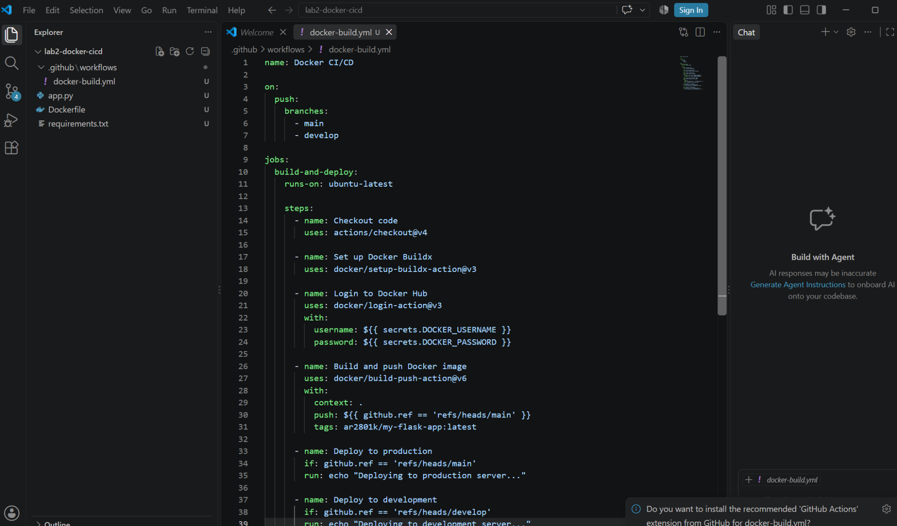
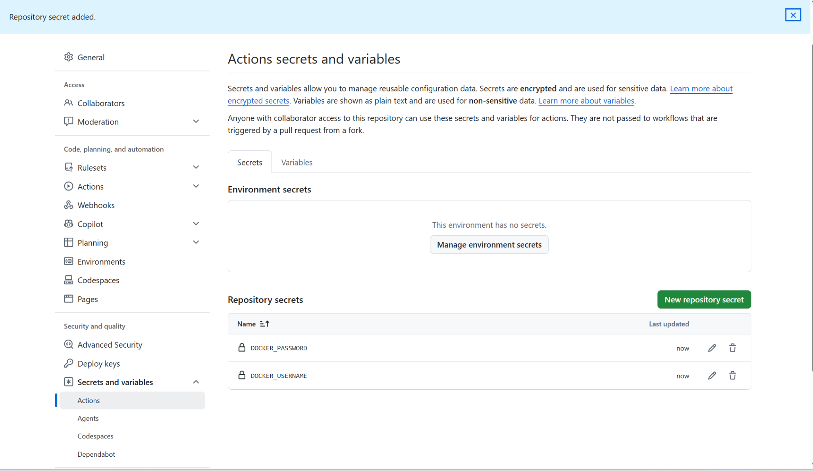
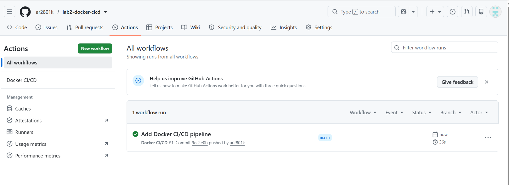
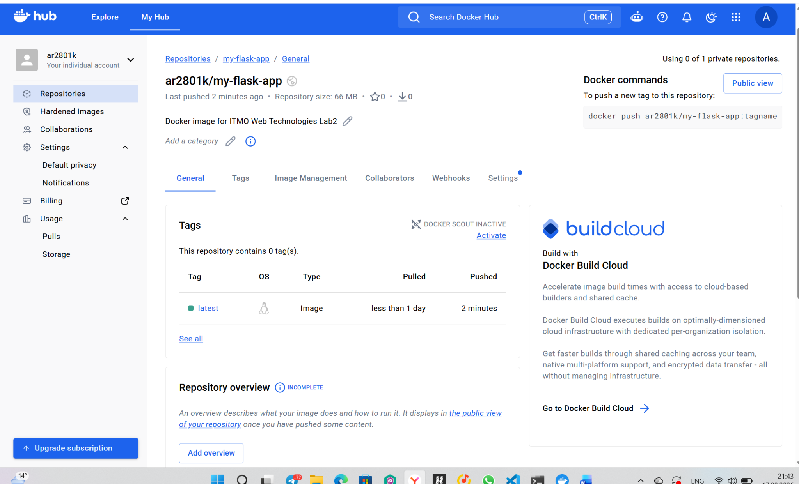
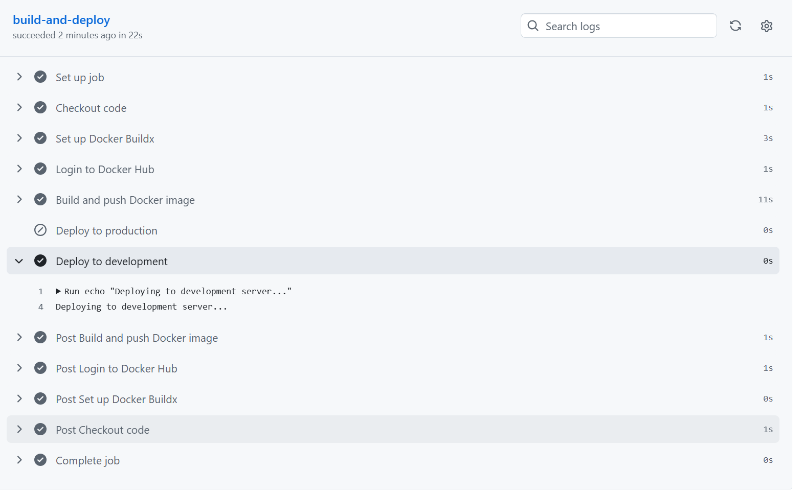
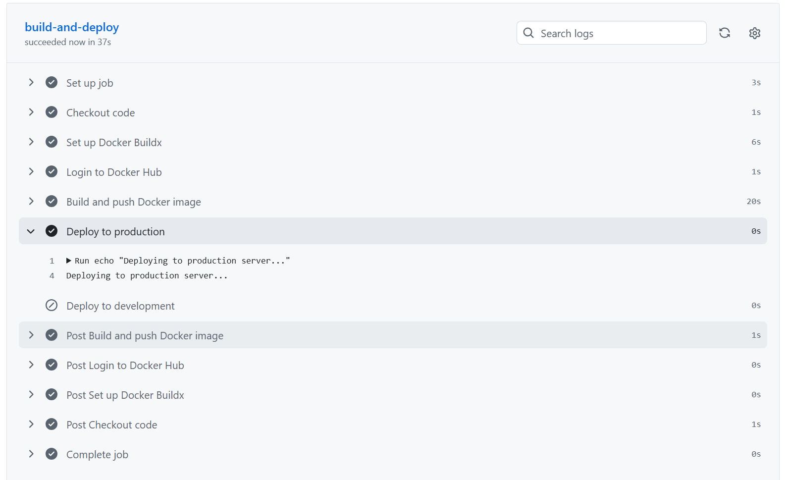

University: [ITMO University](https://itmo.ru/ru/)  
Faculty: [FICT](https://fict.itmo.ru)  
Course: [Введение в веб технологии](https://itmo-ict-faculty.github.io/introduction-in-web-tech/)  
Year: 2026/2027  
Group: U4225  
Author: Kupriyanova Arina Vladimirovna  
Lab: Lab2  
Date of create: 17.09.2026  
Date of finished:  

# Лабораторная работа №2

## CI/CD для Docker приложения

## Цель работы

Научиться настраивать автоматизированный CI/CD-пайплайн с использованием GitHub Actions для сборки Docker-образа, его публикации в Docker Hub и выполнения условного деплоя в зависимости от ветки Git.

## Используемые репозитории

Основной репозиторий с отчётами по лабораторным работам:

```text
https://github.com/ar2801k/2026_2027-introduction-in-web-tech-u4225-kupriyanova_a_v
```

Отдельный репозиторий для настройки CI/CD:

```text
https://github.com/ar2801k/lab2-docker-cicd
```

Docker Hub репозиторий:

```text
ar2801k/my-flask-app
```

## Ход работы

### 1. Подготовка проекта

Для выполнения лабораторной работы был создан отдельный GitHub-репозиторий:

```text
lab2-docker-cicd
```

В него были скопированы файлы из лабораторной работы №1:

```text
app.py
requirements.txt
Dockerfile
```

Также был создан отдельный публичный репозиторий Docker Hub:

```text
ar2801k/my-flask-app
```

### 2. Настройка GitHub Actions

В корне проекта была создана структура:

```text
.github/
└── workflows/
    └── docker-build.yml
```

В файле `docker-build.yml` был настроен CI/CD-пайплайн, который:

- запускается при push в ветки `main` и `develop`;
- использует Ubuntu как runner;
- выполняет checkout исходного кода;
- настраивает Docker Buildx;
- авторизуется в Docker Hub через GitHub Secrets;
- собирает Docker-образ;
- публикует образ в Docker Hub из ветки `main`;
- выполняет условный deploy в зависимости от ветки.

Конфигурация workflow:

```yaml
name: Docker CI/CD

on:
  push:
    branches:
      - main
      - develop

jobs:
  build-and-deploy:
    runs-on: ubuntu-latest

    steps:
      - name: Checkout code
        uses: actions/checkout@v4

      - name: Set up Docker Buildx
        uses: docker/setup-buildx-action@v3

      - name: Login to Docker Hub
        uses: docker/login-action@v3
        with:
          username: ${{ secrets.DOCKER_USERNAME }}
          password: ${{ secrets.DOCKER_PASSWORD }}

      - name: Build and push Docker image
        uses: docker/build-push-action@v6
        with:
          context: .
          push: ${{ github.ref == 'refs/heads/main' }}
          tags: ar2801k/my-flask-app:latest

      - name: Deploy to production
        if: github.ref == 'refs/heads/main'
        run: echo "Deploying to production server..."

      - name: Deploy to development
        if: github.ref == 'refs/heads/develop'
        run: echo "Deploying to development server..."
```

Скриншот конфигурации workflow:



### 3. Настройка Docker Hub и GitHub Secrets

Для безопасной авторизации GitHub Actions в Docker Hub был создан Personal Access Token с правами `Read & Write`.

В настройках GitHub-репозитория были добавлены два секрета:

```text
DOCKER_USERNAME
DOCKER_PASSWORD
```

Секрет `DOCKER_USERNAME` содержит логин Docker Hub:

```text
ar2801k
```

Секрет `DOCKER_PASSWORD` содержит Personal Access Token Docker Hub.

Значения секретов не хранятся в исходном коде и используются только внутри GitHub Actions.

Скриншот настроенных GitHub Secrets:



### 4. Первый запуск CI/CD pipeline

После первого push в ветку `main` GitHub Actions автоматически запустил workflow `Docker CI/CD`.

Pipeline успешно выполнил следующие этапы:

- checkout кода;
- настройку Docker Buildx;
- авторизацию в Docker Hub;
- сборку Docker-образа;
- публикацию образа;
- выполнение шага deploy для production.

Результат успешного запуска workflow:



После завершения pipeline образ был автоматически опубликован в Docker Hub с тегом:

```text
ar2801k/my-flask-app:latest
```

Скриншот опубликованного образа в Docker Hub:



## Лабораторная работа со звёздочкой

### 5. Настройка ветки develop

Для проверки условного деплоя была создана ветка:

```text
develop
```

Workflow был настроен таким образом, чтобы запускаться как для ветки `main`, так и для ветки `develop`.

Для ветки `develop` выполняется шаг:

```text
Deploying to development server...
```

При этом production-deploy пропускается.

Результат выполнения pipeline для ветки `develop`:



### 6. Условный deploy для ветки main

Для ветки `main` pipeline выполняет production-deploy:

```text
Deploying to production server...
```

При этом шаг deploy для development пропускается.

Результат выполнения pipeline для ветки `main`:



Таким образом, поведение CI/CD pipeline зависит от ветки:

```text
main    -> production
develop -> development
```

## Результаты работы

В ходе лабораторной работы были выполнены следующие задачи:

- создан отдельный GitHub-репозиторий для CI/CD;
- создан Docker Hub репозиторий;
- настроен GitHub Actions workflow;
- настроена безопасная авторизация через GitHub Secrets;
- реализована автоматическая сборка Docker-образа;
- реализована автоматическая публикация образа в Docker Hub;
- настроен запуск pipeline для веток `main` и `develop`;
- реализован условный deploy в зависимости от ветки;
- проверено успешное выполнение всех этапов pipeline.

## Вывод

В ходе лабораторной работы был настроен CI/CD pipeline с использованием GitHub Actions.

Pipeline автоматически запускается при изменениях в репозитории, собирает Docker-образ и при работе с веткой `main` публикует его в Docker Hub.

Дополнительно был реализован условный deploy: для ветки `main` выполняется production-сценарий, а для ветки `develop` — development-сценарий.

В результате были получены практические навыки настройки CI/CD, работы с GitHub Actions, Docker Hub, GitHub Secrets и условного выполнения шагов pipeline.